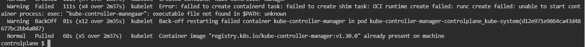
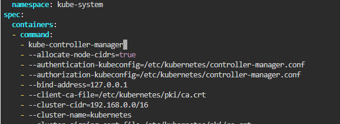

## Run the below command

Check whether all pods are working
```
kubectl get all -A

```

kube-controller-manager-controlplane is is CrashLoopBackOff status.

```
kubectl describe pod kube-controller-manager-controlplane -n kube-system
```




There is a warning of `kube-controller-manegaar` which is not found

Make it `kube-controller-manager`

```
vi /etc/kubernetes/manifests/kube-controller-manager.yaml
```




Wait for the pod to be in running state.