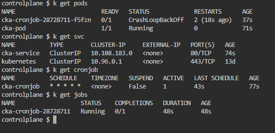
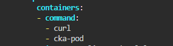
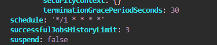

## Run the below command

Check all




Try to get the logs of the cka-cronjob pod. Be sure to use your pod name.

```
kubectl logs cka-cronjob-28728713-5rnhg 

```

Error: Could not resolve host: cka-pod. 

It says cka-pod not found but we should monitor the pod using cka-service.

```
kubectl edit cronjob cka-cronjob

```

Change in command : `cka-pod` to `cka-service` which is our service name.





And since the job should run every minute.

Change the schedule

