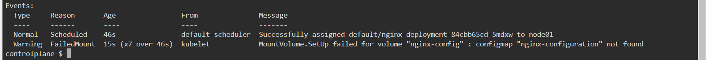

## Run the command to check the issue with the pod

```
k describe pod <pod_name>
```
## Issue is Pod is unable to find the ConfigMap



## 
```
k edit deployment nginx-deployment
```

# change your manifest with below fields 

### first 
```
      initContainers:
      - command:
        - sh
        - -c
        - echo 'Welcome To KillerCoda!'
```

### second 

```
volumes:
- configMap:
    defaultMode: 420
    name: nginx-configmap
  name: nginx-config
```
