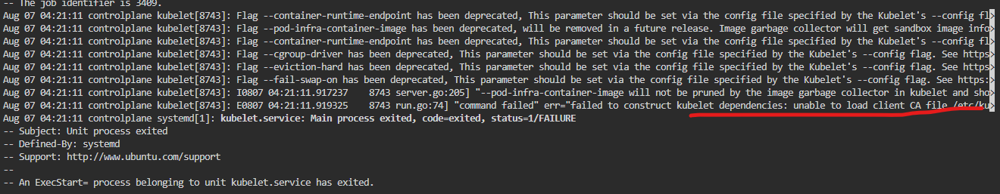
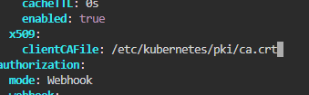

## Run the below code

Check logs
```
journalctl -xeu kubelet

```




Unable to load the certificate file

```
vi /var/lib/kubelet/config.yaml

```

Change to ca.crt



```
systemctl restart kubelet
systemctl status kubelet
```

Again check the logs
```
journalctl -xeu kubelet

```

Port Issue


```
vi /etc/kubernetes/kubelet.conf

```

Change the server to port 6443.

```
systemctl restart kubelet
systemctl status kubelet
```