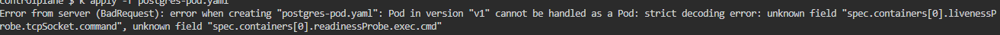

## Run the below command

First to check the error apply the yaml file
```
kubectl apply -f postgres-pod.yaml

```

Error:


Here the livenessProbe and readinessProbe, the naming are mistake.
Here is the changed code.
```
apiVersion: v1
kind: Pod
metadata:
  name: postgres-pod
spec:
  containers:
    - name: postgres
      image: postgres:latest
      env:
        - name: POSTGRES_PASSWORD
          value: dbpassword
        - name: POSTGRES_DB
          value: database
      ports:
        - containerPort: 5432
      livenessProbe:
        tcpSocket:
            port: 5432
        initialDelaySeconds: 30
        periodSeconds: 10
      readinessProbe:
        exec:
          command:
            - "psql"
            - "-h"
            - "localhost"
            - "-U"
            - "postgres"
            - "-c"
            - "SELECT 1"
        initialDelaySeconds: 5
        periodSeconds: 5
```

Apply the manifest
```
kubectl apply -f postgres-pod.yaml
```