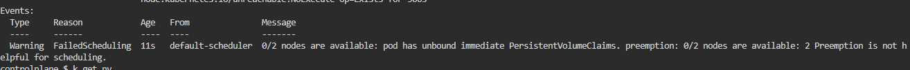
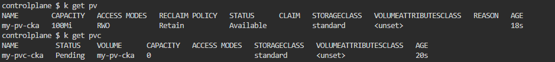
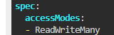

## Run the below command

Describe the pod
```
kubectl describe pod my-pod-cka

```



Check the PersistentVolume and PersistentVolumeClaim


PV is is Available state.

Edit the PV
```
kubectl edit pv my-pv-cka

```

Access mode of pv and pvc are different
Edit the pv to be same as of pvc


Wait for the pod to get into running state.