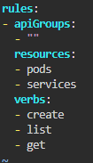

## Run the below command

Check if everything is there

```
k get sa
k get role
k get rolebinding
```

Since we want the role to perform create,list,get in pods and services.

We will edit the role manifest.

```
k edit role dev-role-cka
```



Change it as per the question.